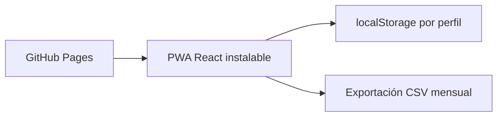

# Arquitectura local de Mis Finanzas

Esta edición está pensada para una sola persona y uso ocasional. La PWA guarda los datos por perfil en el navegador, funciona sin conexión y no necesita Cloudflare, servidor, base de datos ni cuenta de pago.

GitHub Pages publica `dist/` mediante `.github/workflows/deploy-pwa.yaml`. `services/rust-api` queda como una ampliación futura para sincronizar varios dispositivos; la PWA no lo usa mientras no se configure `VITE_GASTOS_API_URL`.

No se eliminó `src-tauri/`; queda como respaldo del proyecto anterior y no participa en el flujo PWA.
